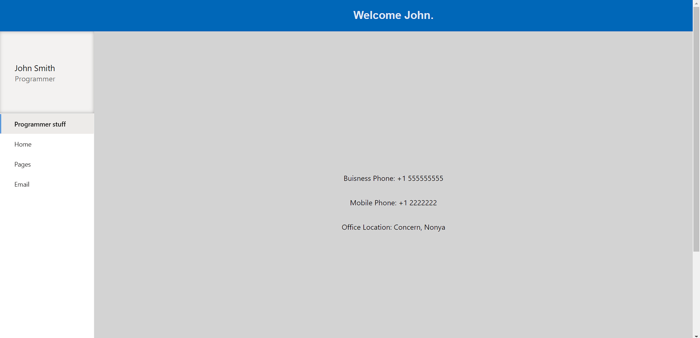

## MSAL Mock Authentication API

This mock api returns an object that is in the same structure as the default object you get back from a login using the Microsoft Authentication Library for a Single Page Application (React App). It assumes you are allowing anybody and everybody with a Microsoft account to sign in to your app. Additionally, the demo is set up as if you are re-calling the profile info after a user is already signed in, but the info could be pulled in when a user signs in as well. If you would like to see the kind of app it is set up to mimic you can follow the turtorial here:

https://learn.microsoft.com/en-us/azure/active-directory/develop/single-page-app-quickstart?pivots=devlang-react

How to use this Mock MSAL User Info / Profile 

1. drop the 'mock-msal-userinfo-api' folder in your 'src' folder
2. open the 'mock-msal-userinfo-api.js' file and set the latency. The latency is there to mimic network latency when making a call to the api.
3. add 'import getUserInfo from "./mock-msal-userinfo-api/mock-msal-userinfo-api";' into whatever component you want to call the data in
4. make the call to the data however you usually would with the real api:

ex of loading on button click

                const [profileInfo, setProfileInfo] = useState(null)
                function _loadProfile(){
                    getUserInfo()
                    .then((returnedProfileInfo)=> {  
                    setProfileInfo(returnedProfileInfo);
                    }).catch((err) => {
                    alert(err);
                    });  
                }

an example of a tipical response sent back when authenticating

                {
                    "@odata.context": "https://graph.microsoft.com/v1.0/$metadata#users/$entity",
                    "displayName": <name>,
                    "surname": <lastName>,
                    "givenName": <firstName>,
                    "id": <id>,
                    "userPrincipalName": <email>,
                    "businessPhones":[
                        "+1 555555555"
                    ],
                    "jobTitle": <job-title>,
                    "mail": null,
                    "mobilePhone": <mobilePhone>,
                    "officeLocation": <officeLocation>,
                    "preferredLanguage": null
                }