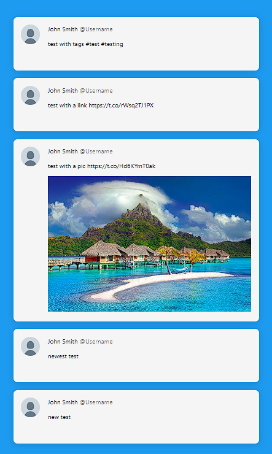

# Twitter Mock Design API

This is set up to mimick a call to twitters REST api returning 5 tweets. Often times people want a few of their buisnesses latest tweets on the homepage and here is a Mock API call that gets the latest 5 tweets from an account and the data (and structure of that data) that would be returned. Note: twitter seems to send back any embedded links, hashtags and images in text format so you will have to parse that stuff out yourself. In the demo I parsed out an image but a link or hashtag will be up to you for now.

How to use this Mock Twitter Get Tweets API

with create-react-app:
1. drop the 'mock-twitter-api' folder in your 'src' folder
2. drop the img folder into the 'public' folder
3. open the 'mock-twitter-api.js' file and set the latency. The latency is there to mimic network latency when making a call to the api.
3. add 'import getTweets() from "./mock-twitter-api/mock-twitter-api";' into whatever component you want to call the data in
4. make the call to the data however you usually would with the real api:

ex:
                const [calledTweets, setCalledTweets] = useState({ data: [] });
                useEffect(() => {
                    // usually a fetch would go here
                    getTweets().then((tweets) => setCalledTweets(tweets));
                }, []);

## Additional Info

This is set up to mock a GET call to endpoint `https://api.twitter.com/2/users/:id/tweets` with the following parameters (without an access token):

"https://api.twitter.com/2/users/<your-user-id>/tweets?max_results=5&tweet.fields=attachments&expansions=attachments.media_keys&media.fields=alt_text%2Cpreview_image_url%2Curl%2Ctype&user.fields=name%2Cprofile_image_url%2Cusername%2Cdescription"

The parameters used are : max results 5, fields are attachments and expanded fields are attachements.media_keys and the media.fields are alt_text, preview_image_url, url and type.

you can actually play around with including additional information in twitters REST api playground [here](https://oauth-playground.glitch.me/)

Also, if you were looking to set up the back end it would probably use something like [this](https://github.com/twitterdev/twitter-api-typescript-sdk) (I haven't tried it though)