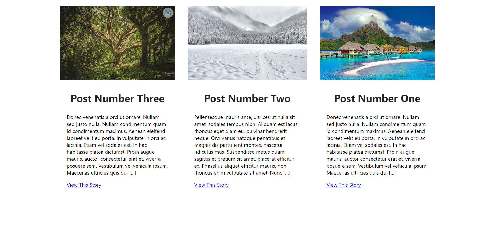

# WordPress Mock Post API

This is a demo of the good ol' wordpress post triptic you see accross many front pages out there. This is the data would get if you made a call to the built in json api that is a part of every wordpress site by default. The fetch you would use to actually get this data would be:

    fetch('https://<your-site-url-here>/wp-json/wp/v2/posts?per_page=3&_embed=wp:featuredmedia&_fields=title,author,id,excerpt,link,_embeded,_links')

This makes a call to the post endpoint, then the `per_page` parameter returns the latest 3 posts (if you want more - for a carousel for example - just increase the number). It then includes the _embed parameter so you don't have to make a seperate call to the `media` endpoint for the post images and finally it specifies which fields to return to keep the request as small as posible. If your looking at the link abouve and wondering what the '_links' is doing there, its beceause calling _embeded without it doesn't work in the WordPress API for some reason. This call will actually return a bunch of data concerning the image (different sizes for srcset, media type info etc) but you don't need it to make this triptic. I have included an example of the actual data returned below - if you would like to use any of it then you can just modify the objects in the array in the 'mock-wordpress-api.js' file.

How to use this Mock Wordpress Post API

with create-react-app:
1. drop the 'mock-wordpress-api' folder in your 'src' folder
2. drop the images folder into the 'public' folder
3. open the 'mock-wordpress-api.js' file and set the latency. The latency is there to mimic network latency when making a call to the api.
3. add 'import getPosts from "./mock-wordpress-api/mock-wordpress-api";' into whatever component you want to call the data in
4. make the call to the data however you usually would with the real api:

ex:

            const [loadedPosts, setLoadedPosts] = useState(null);
            useEffect(() => {
                // usually you would fetch here
                getPosts()
                .then((returnedPosts) => {
                    setLoadedPosts(returnedPosts);
                })
                .catch((err) => {
                    alert(err);
                });
            });

you can then start using the data like you normally would.

___

Actual Data returned from real fetch above in case you want to modify the structure of the data in the mock-wordpress-api.js file: 

                [
                    {
                        "id": <id>,
                        "link": <link-to-post>,
                        "title": {
                            "rendered": "<title-of-post>"
                        },
                        "excerpt": {
                            "rendered": "
Donec venenatis a orci ut ornare. Nullam sed justo nulla. Nullam condimentum quam id condimentum maximus. Aenean eleifend laoreet velit eu porta. In vulputate in orci ac lacinia. Etiam vel sodales est. In hac habitasse platea dictumst. Proin augue mauris, auctor consectetur erat et, viverra posuere sem. Vestibulum vel vehicula ipsum. Maecenas ultricies quis dui [&hellip;]
\n",
                            "protected": false
                        },
                        "author": 1,
                        "_links": {
                            "self": [
                                {
                                    "href": "http://<your-site-url>/wp-json/wp/v2/posts/14"
                                }
                            ],
                            "collection": [
                                {
                                    "href": "http://<your-site-url>/wp-json/wp/v2/posts"
                                }
                            ],
                            "about": [
                                {
                                    "href": "http://<your-site-url>/wp-json/wp/v2/types/post"
                                }
                            ],
                            "author": [
                                {
                                    "embeddable": true,
                                    "href": "http://<your-site-url>/wp-json/wp/v2/users/<user-number>"
                                }
                            ],
                            "replies": [
                                {
                                    "embeddable": true,
                                    "href": "http://<your-site-url>/wp-json/wp/v2/comments?post=<post-number>"
                                }
                            ],
                            "version-history": [
                                {
                                    "count": 1,
                                    "href": "http://<your-site-url>/wp-json/wp/v2/posts/<post-number>/revisions"
                                }
                            ],
                            "predecessor-version": [
                                {
                                    "id": 15,
                                    "href": "http://<your-site-url>/wp-json/wp/v2/posts/<post-number>/revisions/15"
                                }
                            ],
                            "wp:featuredmedia": [
                                {
                                    "embeddable": true,
                                    "href": "http://<your-site-url>/wp-json/wp/v2/media/<media-number>"
                                }
                            ],
                            "wp:attachment": [
                                {
                                    "href": "http://<your-site-url>/wp-json/wp/v2/media?parent=<parent-number>"
                                }
                            ],
                            "wp:term": [
                                {
                                    "taxonomy": "category",
                                    "embeddable": true,
                                    "href": "http://<your-site-url>/wp-json/wp/v2/categories?post=<post-number>"
                                },
                                {
                                    "taxonomy": "post_tag",
                                    "embeddable": true,
                                    "href": "http://<your-site-url>/wp-json/wp/v2/tags?post=<post-number>"
                                }
                            ],
                            "curies": [
                                {
                                    "name": "wp",
                                    "href": "https://api.w.org/{rel}",
                                    "templated": true
                                }
                            ]
                        },
                        "_embedded": {
                            "wp:featuredmedia": [
                                {
                                    "id": <id>,
                                    "date": "<date>",
                                    "slug": "<slug>",
                                    "type": "attachment",
                                    "link": "http://<your-site-url>/2022/09/15/<post-title>//",
                                    "title": {
                                        "rendered": ""
                                    },
                                    "author": <author-number>,
                                    "caption": {
                                        "rendered": ""
                                    },
                                    "alt_text": "<alt-text>",
                                    "media_type": "image",
                                    "mime_type": "image/jpeg",
                                    "media_details": {
                                        "width": 640,
                                        "height": 427,
                                        "file": "2022/09/",
                                        "filesize": 120573,
                                        "sizes": {
                                            "medium": {
                                                "file": "-300x200.jpg",
                                                "width": 300,
                                                "height": 200,
                                                "filesize": 21309,
                                                "mime_type": "image/jpeg",
                                                "source_url": "http://<your-site-url>/wp-content/uploads/2022/09/-300x200.jpg"
                                            },
                                            "thumbnail": {
                                                "file": "-150x150.jpg",
                                                "width": 150,
                                                "height": 150,
                                                "filesize": 9380,
                                                "mime_type": "image/jpeg",
                                                "source_url": "http://<your-site-url>/wp-content/uploads/2022/09/-150x150.jpg"
                                            },
                                            "full": {
                                                "file": "",
                                                "width": 640,
                                                "height": 427,
                                                "mime_type": "image/jpeg",
                                                "source_url": "http://<your-site-url>/wp-content/uploads/2022/09/"
                                            }
                                        },
                                        "image_meta": {
                                            "aperture": "0",
                                            "credit": "",
                                            "camera": "",
                                            "caption": "",
                                            "created_timestamp": "0",
                                            "copyright": "",
                                            "focal_length": "0",
                                            "iso": "0",
                                            "shutter_speed": "0",
                                            "title": "",
                                            "orientation": "0",
                                            "keywords": []
                                        }
                                    },
                                    "source_url": "http://<your-site-url>/wp-content/uploads/2022/09/",
                                    "_links": {
                                        "self": [
                                            {
                                                "href": "http://<your-site-url>/wp-json/wp/v2/media/"
                                            }
                                        ],
                                        "collection": [
                                            {
                                                "href": "http://<your-site-url>/wp-json/wp/v2/media"
                                            }
                                        ],
                                        "about": [
                                            {
                                                "href": "http://<your-site-url>/wp-json/wp/v2/types/attachment"
                                            }
                                        ],
                                        "author": [
                                            {
                                                "embeddable": true,
                                                "href": "http://<your-site-url>/wp-json/wp/v2/users/<user-number>"
                                            }
                                        ],
                                        "replies": [
                                            {
                                                "embeddable": true,
                                                "href": "http://<your-site-url>/wp-json/wp/v2/comments?post=<post-name>"
                                            }
                                        ]
                                    }
                                }
                            ]
                        }
                    }
                ]

